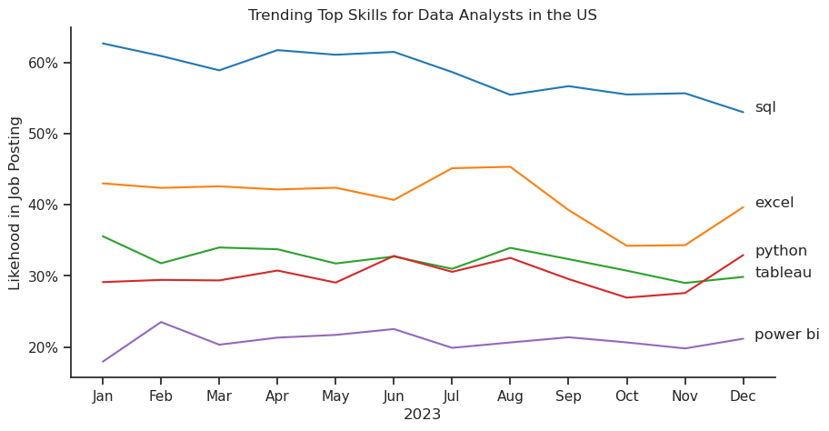
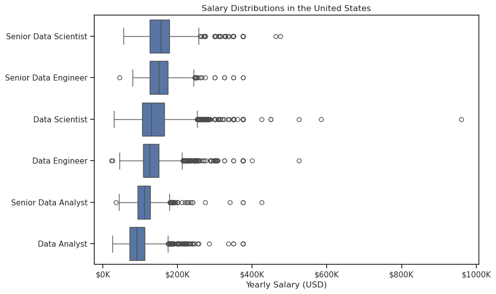

Perfect! Here's an enhanced version of your `README.md` with embedded charts and outputs. I’ll suggest where to place images and name them so they integrate smoothly when you push them to GitHub.

---

# 📈 Skills Demand Analysis for Top Data Roles

This project explores the **most in-demand skills** across the top three data roles—**Data Analyst**, **Data Engineer**, and **Data Scientist**—by analyzing job posting data. It's designed to guide aspiring professionals in targeting the skills that matter most.


## 🔍 Objective

To identify which skills are most commonly required for the most popular data roles, helping individuals prioritize their learning paths and career development.


## 🧠 Key Insights

### 🔝 Top 3 Roles Identified

* **Data Analyst**
* **Data Engineer**
* **Data Scientist**

### 📊 Top 5 Skills by Role

| Role           | Top Skills                       |
| -------------- | -------------------------------- |
| Data Analyst   | SQL, Excel, Tableau, Python, SAS |
| Data Engineer  | SQL, Python, AWS, Azure, Spark   |
| Data Scientist | Python, SQL, R, SAS, Tableau     |

---

## 📸 Visual Outputs

### 📌 Most Popular Job Titles


### 📌 Top Skills per Role

* **Data Analyst:**

  

* **Data Engineer:**

  

* **Data Scientist:**

  

> These bar charts clearly highlight the most requested skills per role. Python and SQL are dominant, while tools like Excel, Tableau, AWS, and R are role-specific standouts.


# The Analysis
## 2. How are in-demand skills trending for Data Analysis

*This plot illustrates the trending top skills required for Data Analyst positions in the US throughout 2023. SQL consistently ranks as the most in-demand skill, maintaining a high presence of over 50% in job postings across all months. Although there is a slight downward trend in the latter half of the year, SQL remains a foundational requirement for data analyst roles, underlining its critical role in data extraction and manipulation.

Excel shows a relatively stable demand in the first half of the year, with a noticeable increase around July and August, peaking at about 45%. However, it dips again in the fall before rebounding slightly by December. This fluctuation may indicate that employers rely more on Excel during mid-year reporting periods or budget planning cycles. Python, meanwhile, remains steady but slightly declines in demand, hinting that while it is important, it's often supplemented or replaced by other specialized tools depending on the job scope.

Tableau and Power BI, both data visualization tools, show consistently lower demand compared to other skills. Tableau sees minor fluctuations with a slight rise mid-year before dipping again, while Power BI remains the least in-demand skill, staying under 25% throughout. These trends suggest that while data visualization is important, employers may prefer candidates who can combine visualization skills with data manipulation and analysis, such as those offered by SQL or Excel.

## 3. How well do jobs and skills pay for Data Analysis?

### Salary Analysis
#### Visualize Data
```

sns.set_theme(style='ticks')

plt.figure(figsize=(10, 6)) # Set size: make nice and big

sns.boxplot(data=df_US_top6, x='salary_year_avg', y='job_title_short', order=job_order)


plt.title('Salary Distributions in the United States')
plt.xlabel('Yearly Salary (USD)')
plt.ylabel('')

ticks_x = FuncFormatter(lambda y, pos: f'${int(y / 1000)}K')  # Note: divide by 1000, not 100
plt.gca().xaxis.set_major_formatter(ticks_x)

plt.tight_layout()
plt.show()
```


 Insights from U.S. Salary Distributions for Top Data Roles
Senior-level roles (e.g., Senior Data Scientist, Senior Data Engineer) consistently earn higher median salaries compared to their junior counterparts.

Data Scientists and Data Engineers show a wider salary range and more outliers, indicating high variability in compensation — likely influenced by company size, location, or seniority.

Outliers are present across all roles, with some salaries exceeding $500K and even approaching $1M — possibly reflecting executive-level or Silicon Valley positions.

Data Analysts (including Senior) tend to have lower median salaries and narrower distributions, suggesting more standardized compensation bands.

Overall, salary distributions are right-skewed, with long tails indicating a small number of very high earners in each role.


### --------------------------------
## 🛠 Tools & Technologies used in this project

* Python
* Jupyter Notebook
* Pandas, Matplotlib, Seaborn
* Data Wrangling & Visualization


## 📁 Project Files

* `2_Skills_Demand.ipynb` — Jupyter Notebook with full analysis
* `images/` — Folder containing exported visualizations (charts)

---

## 🎯 Key Takeaways

* **SQL and Python** are foundational skills across all roles.
* **Visualization tools** (Excel, Tableau) are essential for analysts.
* **Cloud and big data tools** (AWS, Azure, Spark) are critical for engineers.
* **Statistical programming** (R, SAS) remains vital for scientists.

---

## 🚀 Future Enhancements

* Analyze more job titles (e.g., BI Analyst, ML Engineer)
* Perform geographic or company-based filtering
* Create an interactive dashboard using **Streamlit** or **Plotly Dash**
* Track skill trends over time

---

## 💼 About Me

I'm a data enthusiast with a strong interest in AI applications, machine learning, and the transformative potential of large language models (LLMs). My focus areas include LLM fine-tuning, building intelligent systems, and using data to drive meaningful outcomes.

Outside of traditional data science work, I also explore the creative side of AI. I design and sell AI-generated art via my Instagram page, blending technology and creativity to produce original visual content.

This project showcases my ability to:

Analyze real-world data for career insights

Visualize trends and skill demands

Communicate technical findings clearly

I'm always learning and exploring new tools at the intersection of AI, automation, and design — with the goal of contributing to innovative, human-centered solutions.

📧 \[Email: ](mario2014foto@gmail.com)

🌐 \[www.linkedin](https://www.linkedin.com/in/mario-ibarra-4b511833)

🐙 \[[GitHub Profile Link](https://github.com/mario-ibarra)]

[Instagram:](https://www.instagram.com/marioibarra2024/)


